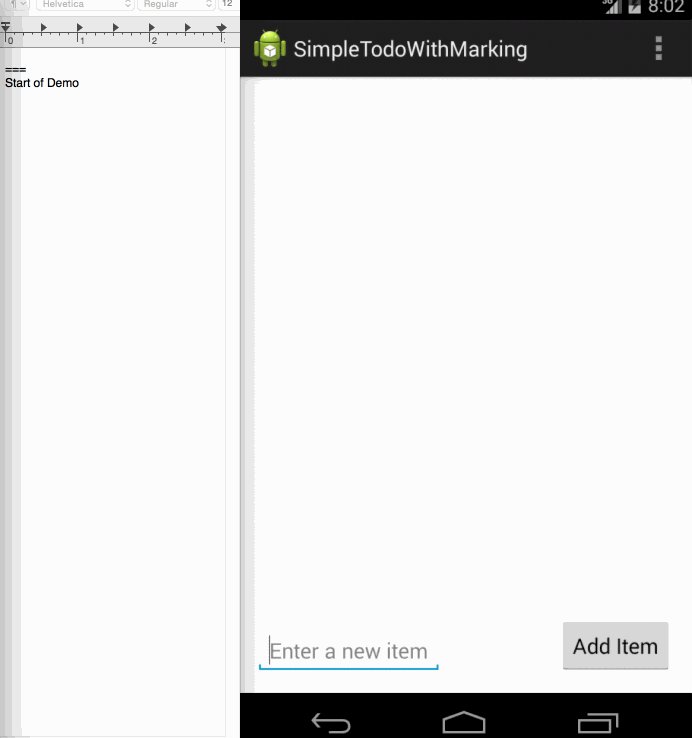

# My First Android App

## Getting the setup ready
### Install android studio:
* https://developer.android.com/sdk/index.html
* Course - https://www.udacity.com/course/how-to-install-android-studio--ud808

### Emulator
Emulators make life easy (sometimes) and Genymotion is one of the nicest emulators out there.
* https://www.udacity.com/course/how-to-install-android-studio--ud808
* NOTE: I strongly recommended using real android device for testing the app

### Showing-off your demo
To showcase the work you did, creating png screen recording is one of the most portable ways.
* Check out LICEcap - recording screen. - http://www.cockos.com/licecap/.

### Chrome extensions
I highly recommend using browser extensions - XML and JSON viewer.  
Simply google it and install whichever you like.

### Github:
If you are here, you already know Github!
###### Create account:
* https://github.com/
* https://help.github.com/
###### Install Github UI app:
* https://mac.github.com/
* https://windows.github.com/
###### Trainings and cheats:
* https://help.github.com/articles/github-glossary/
* https://training.github.com/kit/downloads/github-git-cheat-sheet.pdf
* https://help.github.com/articles/set-up-git/

### Java refresher:
https://www.youtube.com/watch?v=WPvGqX-TXP0&list=PLGLfVvz_LVvSPjWpLPFEfOCbezi6vATIh&index=2

### Markdown basics
*  https://help.github.com/articles/markdown-basics/
*  This discusses Github specific: differences: https://help.github.com/articles/github-flavored-markdown/
*  This is interactive interpreter to play around: http://dillinger.io/

## Quickstart
* Developing our First App Using Android Studio (Step-by-Step Todo App) http://goo.gl/8R7Mty
* Quick start video https://vimeo.com/113893630.
* Full credit to Codepath (https://codepath.com/)

## Demo:
Demo should include:
1. Add list of items
2. Deleting an item using long press
3. Show that the 'DONE status' is persistent by re-opening the app

